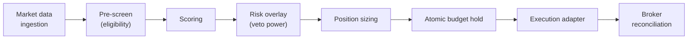

# TankCore

An event-driven quantitative trading research platform, engineered like the credit-decisioning
systems I build professionally: every order passes through layered risk controls, every state
change is reconcilable, and nothing reaches an exchange without surviving a promotion gate.

> **The source is private** — the platform is a personal research project and parts of it are
> commercially sensitive. This repo documents the architecture. The strategy layer (signals,
> universe selection, parameters) is deliberately not documented anywhere public.
>
> **TankCore runs in shadow and paper mode only.** It trades simulated money against live market
> data. This is an engineering project, not a track record, and nothing here is investment advice.

## The pipeline

The design borrows directly from real-time credit underwriting — a domain where I've spent six
years building decision pipelines. A trade candidate flows through the same shape a loan
application does:

Each stage can reject; only a candidate that survives all of them becomes an order. Reason codes
travel with every rejection — the same discipline as adverse-action reporting in lending.

## Architecture decisions worth stealing

- **Two independently restartable services over Redis Streams.** The data/decision service and the
  execution service share nothing but the stream. Either can crash and restart without the other
  noticing; events replay from the last acknowledged ID.
- **Three modes — live, shadow, backtest — swap adapters, not logic.** The decision pipeline is
  identical in all three; only the market-data source and execution sink change. What you
  backtest is literally what you run.
- **Atomic budget holds in Lua.** Reserve → commit → release runs as a single atomic script, so a
  crash mid-order can't leak reserved capital — no partial state, ever.
- **Safety invariants are hardcoded and checked at startup.** Position limits, order-rate caps,
  and mode guards aren't configuration; violating them means the service refuses to boot. Kill
  switches halt trading without halting data collection.
- **Deterministic backtesting.** Same inputs, same fills, same metrics (Sharpe, Sortino, Calmar)
  every run — otherwise a backtest is an anecdote.
- **Promotion is gated, not vibes.** Strategy promotion from shadow toward live requires 10+
  shadow-mode days, zero safety halts, and p99 decision latency under 500ms. (No strategy has
  been promoted to live trading; shadow mode is the point.)

## Stack

Python 3.12 · Redis Streams · TimescaleDB · Parquet · Lua (atomic holds) · systemd ·
Prometheus/Grafana

## Provenance

Like everything in my recent work, TankCore was built through the
[FishTank agent platform](https://github.com/GuppitusMaximus/fish-tank) — planned, implemented,
and QA-verified by autonomous AI agents against plans I wrote and reviewed. The QA suite covers
the event pipeline, the promotion validator, the shadow execution adapter, and the service
factory wiring.
